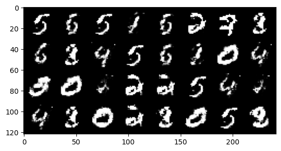

# Vanilla GAN on MNIST

A simple **Generative Adversarial Network (GAN)** built with **PyTorch** that learns to generate handwritten digits from random noise.

<p align="center">
  
  <br>
  <em>Digits generated by the trained Generator from random noise.</em>
</p>


## Project Structure

- **gan-mnist.ipynb**: Notebook with the full model, training loop and generated samples (trained on Kaggle).
- **generated_digits.png**: Sample output from the trained Generator.


## How It Works

Two networks compete against each other:

1. **Generator**: Takes a random noise vector and turns it into a 28×28 digit image.
2. **Discriminator**: Looks at an image and decides if it is real (from MNIST) or fake (from the Generator).

As training goes on, the Generator gets better at fooling the Discriminator, and the images start to look like real digits.


## Model Details

| | Generator | Discriminator |
|---|---|---|
| **Architecture** | 4 fully connected layers + BatchNorm | 2 fully connected layers |
| **Activation** | ReLU, Tanh (output) | LeakyReLU (0.2) |
| **Input** | Noise vector (64) | Flattened image (784) |
| **Output** | Image (784 → 28×28) | Real / fake score |

**Training setup**

- **Dataset**: MNIST (60,000 handwritten digits)
- **Loss**: Binary Cross Entropy (`BCEWithLogitsLoss`)
- **Optimizer**: Adam, learning rate `3e-4`
- **Batch size**: 32
- **Epochs**: 2000
- **Image normalization**: scaled to `[-1, 1]`


## Installation

1. **Clone the repository**:
   ```bash
   git clone https://github.com/afsal4/gan_mnist.git
   cd gan_mnist
   ```

2. **Install dependencies**:
   ```bash
   pip install torch torchvision matplotlib jupyter
   ```

3. **Run the notebook**:
   ```bash
   jupyter notebook gan-mnist.ipynb
   ```

> A GPU is recommended. The notebook sets `device = 'cuda'`, so change it to `'cpu'` if you don't have one.


## Note

The trained model weights are available only on Kaggle and are not included in this repository.


---

Built with ❤️ using PyTorch.
